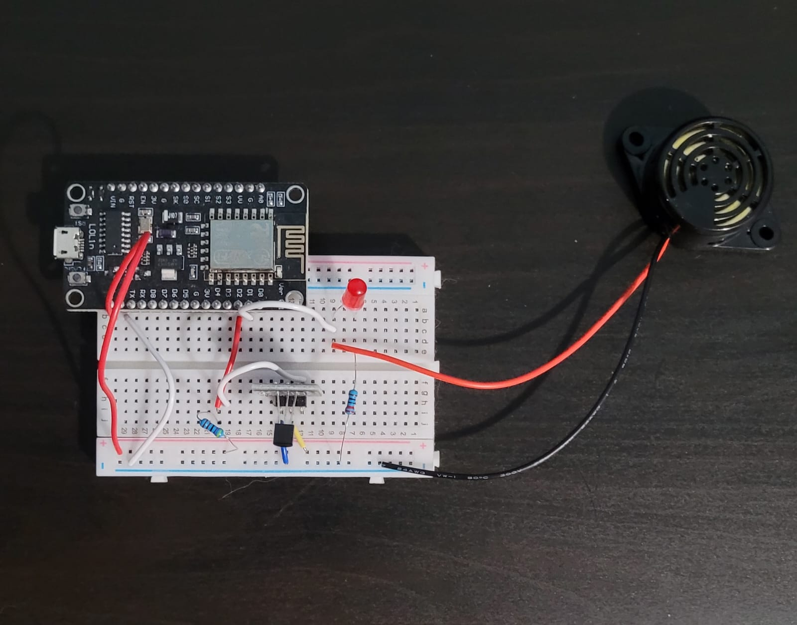

# ESP8266 Temperature Monitor with Web Interface, LED & Buzzer Alert

This project uses an **ESP8266 (NodeMCU)** and a **DS18B20** temperature sensor to measure ambient temperature and display it on a simple web interface over Wi-Fi.  

When the temperature exceeds a defined threshold, a **LED** and a **buzzer** are triggered as visual and audible alerts.

---

## Components

| Component | Description |
|------------|--------------|
| ESP8266 (NodeMCU) | Main microcontroller with Wi-Fi |
| DS18B20 | Digital temperature sensor |
| 4.7kΩ resistor | Pull-up resistor for DS18B20 data line |
| LED | Visual temperature alert |
| 220Ω resistor | Current-limiting resistor for LED |
| Active buzzer | Audible temperature alert |
| Breadboard & jumper wires | For prototyping |
| Micro USB cable | For power and programming |

---

## Wiring Diagram

---

## Software Requirements

- **Arduino IDE**
- **Libraries:**
  - `OneWire`
  - `DallasTemperature`
  - `ESP8266WiFi`
  - `ESP8266WebServer`

---

## Setup & Running

1. Connect all components according to the wiring diagram.  
2. Open the Arduino IDE and install the required libraries.  
3. Open the provided `.ino` file.  
4. Update your Wi-Fi **SSID** and **password** in the sketch.  
5. (Optional) Adjust the temperature **threshold** variable in the code.  
6. Upload the sketch to your ESP8266.  
7. Open the **Serial Monitor** to find your device’s IP address.  
8. Open that IP in a web browser to view real-time temperature readings.

---

## Web Interface

The ESP8266 hosts a simple web page that:
- Displays the current temperature in °C  
- Automatically refreshes at regular intervals 

---

## Alerts

When the temperature rises above the threshold:
- The **LED** turns **ON**  
- The **buzzer** sounds to alert the user  

Both deactivate automatically once the temperature drops below the threshold.
